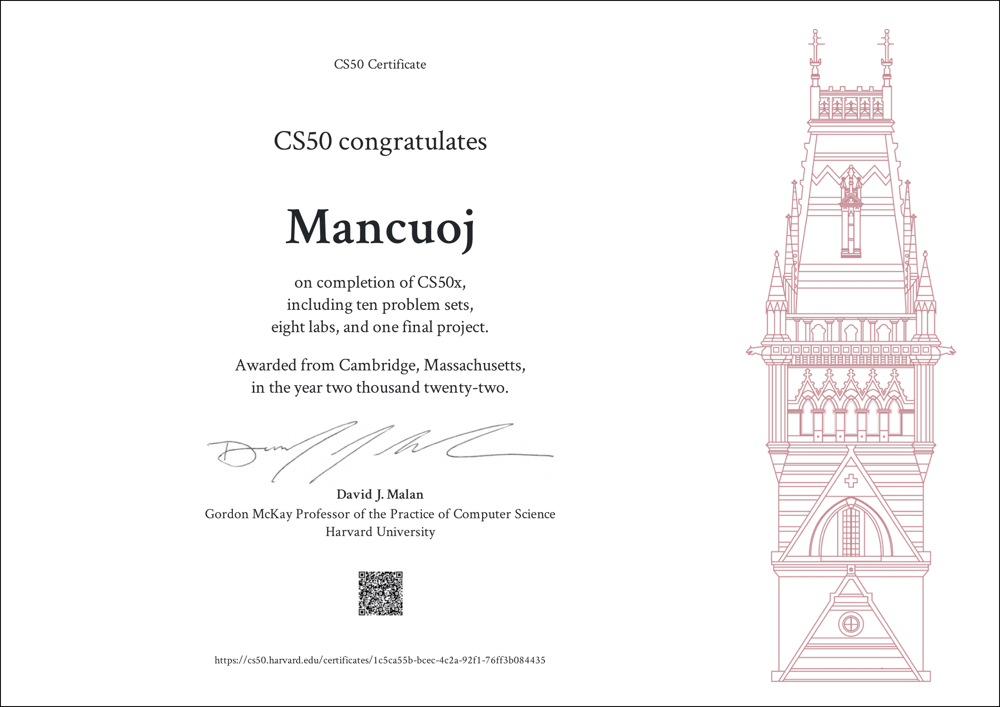

# 简介 <Badge type="tip" text="已完成" />

> 摘自 [CS 自学指南](https://csdiy.wiki/) 的评价

连续多年被哈佛大学学生评为最受欢迎的公选课程。

Malan 教授上课非常有激情，撕黄页讲二分法的场面让人记忆犹新（笑）。

但因为它的入门以及全校公选的属性，课程内容难度比较温和，但是课程作业质量非常高而且全部免费开源，非常适合小白入门，或者大佬休闲。

## 学后感

神中神！正如 CS61A 对于飞猪大佬的重要意义，CS50x 也为我推开了新世界的大门。

跳过了刚开始的 Scratch，从第一章开始就感受到了国外顶级院校的教学水准，入门并不强行灌输细节

... 慢慢补充中

附上我完成全部作业后获得的证书

## 配套设施

只列出我重点关注的几项，之后的其他课程也是如此

视频+文档有助于理解课程内容，追求速度可以只看文档

作业质量 very 高，自动评分是老师自己写了套运行在 GitHub 上的系统？非本校生也可以免费使用，泪目了

甚至做完后还能得一个免费的电子版证书装杯，这可是哈佛的章，亚雷 ...

- ✅ 视频
- ✅ Notes
- ✅ 10 Problem Sets + 8 Labs + 1 Final Project
- ✅ 对所有人开放的自动评分
- ✅ 免费证书

## 有用的链接？

- [我自己关于作业的解答](https://github.com/mancuoj/CS50x) ，仅供参考
- [课程链接](https://cs50.harvard.edu/x) ，关于 CS50 和 CS50x 的区别大概就是一个面向校内学生，一个面向大众
- [Discord](https://discord.com/invite/cs50) ，挺活跃的，可以在里面问问题
- [记分册](https://cs50.me/cs50x) ，可以看到你的完成进度
- 别的基本都在课程链接里了，自己去寻找宝藏吧 😆