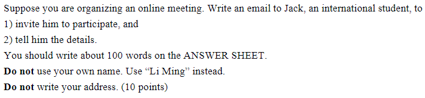
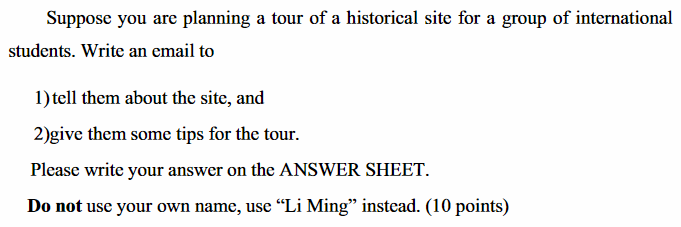
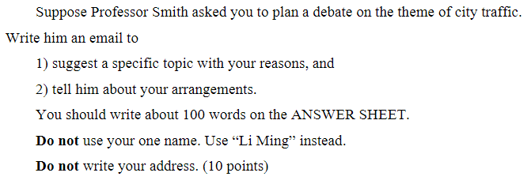
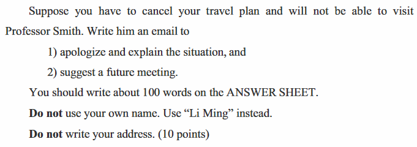

# 历年真题

::: tip  
100词，10分，通常是信或通知

第一段一句或两句，写给熟人先寒暄后说目的，陌生人先自我介绍后说目的

中间段，按题目要求写相应内容，辅以感谢、强调、对比等

最后段感谢、期待、展望、再次致歉  
:::

## 2021

## 2020

## 2019

1. It is great to receive your invitation to plan a debate on the theme of city traffic. I am writing to share my ideas about the topic and relevant arrangements.
2. I deem that it is advisable to choose this topic: Private Cars -- to Encourage or to Limited? There are two reasons. Firstly, in recent years, cities in China have been featured by the rapid economic development, which enabled more families to have additional money to purchase cars. Admittedly, cars bring us great convenience and help us to enjoy more comfortable. However, it is also cars that cause the roads to be congested.
3. I suggest that this debate should be held in the Center of Student Activities from 18:00 to 20:00 on December 12, if you have any better suggestion, please feel free to inform me.

## 2018

1. I am quite grateful for your invitation to talk about my paper. Anyway, I have to cancel my plan and so I am writing for the purpose of apologizing and specifying the reason.
2. Several days ago, I did plan to go, but you know I was extremely busy during the past six months because I focused all my eyesight on the preparation for the national entrance examination for postgraduates. Unfortunately, owing my carelessness, I did not notice that the date for the test is just the day I planned to visit you until this moment. Accordingly, I have no option but cancel the plan.
3. I sincerely hope that you can forgive me and I shall visit you after the examination at your convenience.

## 2017

## 2016

## 2015

## 2014

## 2013

## 2012
